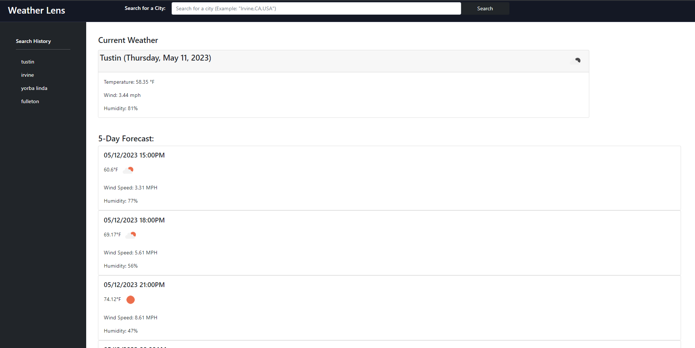
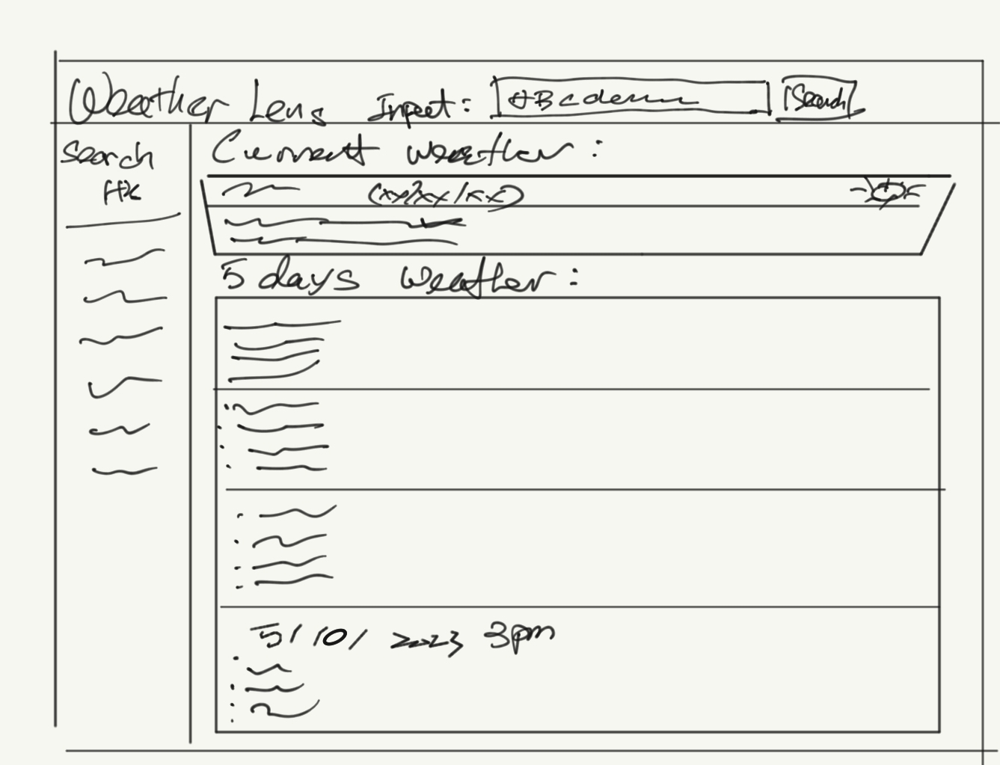

# Weather-Dashboard

- [Explore the docs]( https://github.com/jenho-webdev/Weather-Dashboard)

- [Deployed Application](https://jenho-webdev.github.io/Weather-Dashboard)

- [Report Bug](https://github.com/jenho-webdev/Weather-Dashboard/issues/)

- [Request Feature](https://github.com/jenho-webdev/Weather-Dashboard/issues)

<!-- TABLE OF CONTENTS -->

## Table of Contents

- [About The Project](#about-the-project)

- [User Story](#user-story)

- [Acceptance Criteria](#acceptance-criteria)

- [Mock-up](#mock-up)

- [Wireframe](#wireframe)

- [Roadmap](#roadmap)

- [Contact](#contact-me)

- [Acknowledgments](#acknowledgments)

## About the Project

A simple weather forecast dashboard using openweather API Current Weather API and 3hours/5days max weather forcast API to give users weather forecast for the next 5 days.
It allow user to retrieve weather data for cities with city name, state code and country code.

## User Story

```
AS A traveler
I WANT to see the weather outlook for multiple cities
SO THAT I can plan a trip accordingly
```

## Acceptance Criteria

```
GIVEN a weather dashboard with form inputs
WHEN I search for a city with at least city name and state code
THEN I am presented with current and future conditions for that city and that city is added to the search history
WHEN I view current weather conditions for that city
THEN I am presented with the city name, the date, an icon representation of weather conditions, the temperature, the humidity, and the wind speed
WHEN I view future weather conditions for that city
THEN I am presented with a 5-day forecast that displays the date, an icon representation of weather conditions, the temperature, the wind speed, and the humidity
WHEN I click on a city in the search history
THEN I am again presented with current and future conditions for that city
```

## Mock-Up

The following image shows the web application's appearance and functionality:



# Wireframe



## Roadmap

- Location map
- Weather history

## Contact Me

[![LinkedIn][linkedin-shield]](https://www.linkedin.com/in/jen-h-202a1723/)
[![Github][Github-shield]](https://github.com/jenho-webdev/Personal-Portfolio)
[![Slack][slack-shield]](https://jenworkspace-as73396.slack.com/archives/C052QLTJQHG)

## Acknowledgments

- Shield and badges used in this markdown document were sourced from [Shields.io](https://shields.io/).
- This website was inspired by UCIBookcamp weekly assignments. The user story, acceptance criteria were built upon the original assignments content from the UCI Bootcamp Full Stack WebDev Course.

<!-- MARKDOWN LINKS & IMAGES -->

[linkedin-shield]: https://img.shields.io/badge/-LinkedIn-black.svg?style=for-the-badge&logo=linkedin&colorB=555
[Github-shield]:https://img.shields.io/badge/GitHub-100000?style=for-the-badge&logo=github&logoColor=white
[slack-shield]:https://img.shields.io/badge/Slack-4A154B?style=for-the-badge&logo=slack&logoColor=white
